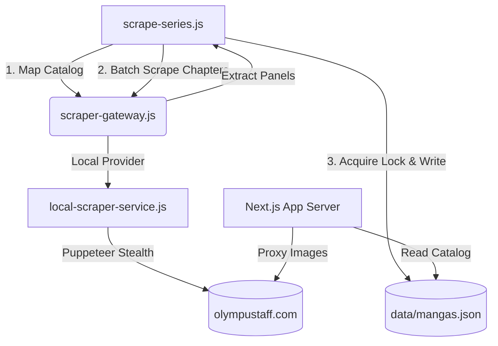

# 🌌 Neo Manga Reader & Dynamic Scraper

A premium, self-hosted webtoon and manga reader application built with **Next.js 16 (React 19)**, featuring a high-performance **background scraper pipeline** that dynamically maps, scrapes, and self-heals chapter extractions from scanlation sites. It includes a built-in **Live Scraper HUD Console** directly in the browser to control and monitor crawls in real-time.

---

## 🚀 Key Features

### 1. 🔬 Live Web Scraper HUD Dashboard
* **Scraper Console HUD**: Trigger scraping directly from the browser interface and watch live terminal logs stream in a glassmorphic dashboard panel.
* **Animated Progress Tracking**: Features an animated gradient progress bar showing real-time percentages of chapters mapped and scraped.
* **Console Minimization**: Minimize the HUD during active scrapes to browse the library. A floating status badge (`Scraping Progress (X%)`) in the bottom-right corner keeps you updated and lets you restore the console with a single click.
* **Dual-Provider Abstraction**: Toggles between a custom **Local Puppeteer (Stealth)** scraper and **Firecrawl API** via a unified scraper gateway.
* **Force Overwrite Control**: Toggle the "Force Overwrite / Refresh Existing Chapters" checkbox to re-scrape and update all pages of already indexed chapters.

### 2. 📖 Immersive Reader HUD
* **Two Layout Toggles**: Continuous vertical scroll (Webtoon mode) or page-by-page slideshow.
* **Ambient Themes**: Dark (default), AMOLED (pitch black for OLED), Sepia (warm paper-tone), and Light.
* **Auto-Scroll Engine**: Hands-free reading with adjustable speeds (**1x to 5x**), toggleable via **Spacebar** or HUD controls.
* **Anti-Strain Dimmer**: Controls page brightness overlays (**100%, 80%, 60%, 40%**) for night reading.
* **Keyboard Hotkeys**: Arrow keys for quick scrolling/page flipping and chapter jumping.
* **Smart Progress Tracker**: Automatically tracks read status per chapter in `localStorage` when reaching the end of a chapter.

### 3. ⚡ Smart Scraper Pipeline
* **Direct Sequential Generation**: Maps only the series landing page to find the latest chapter, then automatically constructs sequential chapter URLs from `0` to the latest. This eliminates slow multi-page mapping and guarantees discovery of missing middle chapters.
* **Self-Healing Lock System**: Protects the local database file `mangas.json` from concurrent write corruption. If a previous run crashes, the system validates the lock process's PID and clears stale locks automatically.
* **3-Pass Self-Healing Retries**: Combats network timeouts by running up to 3 passes with adapting timeouts and thread concurrency:
  * **Pass 1**: High concurrency (4 threads), 35s timeout.
  * **Pass 2**: Medium concurrency (2 threads), 60s timeout.
  * **Pass 3**: Single-thread isolation, 90s timeout.
* **Ad & Banner Filtering**: Strips out logos, icons, widgets, and advertising banners, preserving only the manga content panels.
* **Image Proxy API**: dedicated route to bypass anti-hotlinking referrer checks on host scanlation sites.

---

## 🛠️ Architecture



---

## 📦 Getting Started

### 📋 Prerequisites
- **Node.js** v20+
- **Google Chrome** installed (required for Puppeteer local mode)

### 🔧 Installation (Step-by-Step)
1. **Clone the Repository**:
   ```bash
   git clone https://github.com/anasMARZAK/teamxnovelscraperv1.git
   cd teamxnovelscraperv1
   ```
2. **Install Dependencies**:
   ```bash
   npm install
   ```
3. **Configure the Environment**:
   Create a `.env` file in the root directory:
   ```env
   # Choose between 'local' (Puppeteer stealth) or 'firecrawl'
   SCRAPER_PROVIDER=local

   # (Optional) Firecrawl API Key if using 'firecrawl' provider
   FIRECRAWL_API_KEY=your_firecrawl_api_key_here
   ```

---

## 🖥️ Running the Application

### 1. Start the Dev Server
Launch the Next.js frontend application:
```bash
npm run dev
```
Open **[http://localhost:3000](http://localhost:3000)** in your browser to view the interface.

### 2. Triggering Scrapes
You can index a series in two ways:
* **Via the Web Interface (Recommended)**:
  1. Open the dashboard.
  2. Paste a series URL (e.g., `https://olympustaff.com/series/TCF`) in the input box.
  3. Select your provider (`Local Scraper` or `Firecrawl`).
  4. (Optional) Check "Force Overwrite" if you want to refresh already crawled chapters.
  5. Click **Index Series** to start background scraping with the live console.

* **Via the Command Line**:
  ```bash
  node scripts/scrape-series.js <SERIES_URL> [LIMIT]
  ```
  * *Full Scrape*: `node scripts/scrape-series.js https://olympustaff.com/series/TCF`
  * *Limit Scrape (First 5 chapters)*: `node scripts/scrape-series.js https://olympustaff.com/series/TCF 5`

---

## 🔧 Troubleshooting & Error Handling

### 1. Stale Database Locks
* **Symptoms**: Scraper HUD shows `Database is locked by another process` repeatedly.
* **Resolution**: The scraper features self-healing stale locks. If the process PID in the lock file is not running, it automatically deletes it. If a locked message persists, manually delete the lock file in the project folder:
  ```bash
  # Windows PowerShell
  Remove-Item data/mangas.json.lock
  
  # Linux/macOS
  rm data/mangas.json.lock
  ```

### 2. Puppeteer / Chrome Issues (Local Provider)
* **Symptoms**: Scraping fails immediately during mapping with a Puppeteer launch error.
* **Resolution**:
  * Ensure **Google Chrome** is installed on your machine.
  * If running on a headless Linux server, make sure system dependencies for Chrome are installed:
    ```bash
    npx puppeteer browsers install chrome
    ```

### 3. Rate-Limiting & IP Bans (429 Errors)
* **Symptoms**: Chapters fail to scrape, showing empty pages or continuous retry passes.
* **Resolution**:
  * Olympus Staff or your ISP may be rate-limiting requests. The crawler automatically retries with lower concurrency (Pass 2 downscales to 2 threads, Pass 3 downscales to single-thread with 90s delays).
  * If failures persist, toggle the scraper provider to `Firecrawl API` (requires a Firecrawl API key in `.env`).

---

## 📂 Project Directory Structure

```filepath
├── data/
│   ├── mangas.json          # Main manga database
│   ├── mangas.json.bak      # Automatic database backup
│   └── jobs/                # Scraper job status logs
├── scripts/
│   ├── scrape-series.js     # Main crawler orchestrator
│   ├── scrape-missing.js    # Specific chapter crawl utility
│   ├── scraper-gateway.js   # Scraper provider router
│   └── local-scraper-service.js # Puppeteer stealth engine
├── src/
│   ├── app/
│   │   ├── page.tsx         # Dashboard catalog
│   │   ├── series/          # Chapter directories & Viewer
│   │   └── api/             # Catalog, Proxy & Scraper REST APIs
│   └── components/
│       └── Reader.tsx       # Interactive HUD reader component
```

---

## 🛡️ License
This project is open-source and free to use for personal, local archiving.
